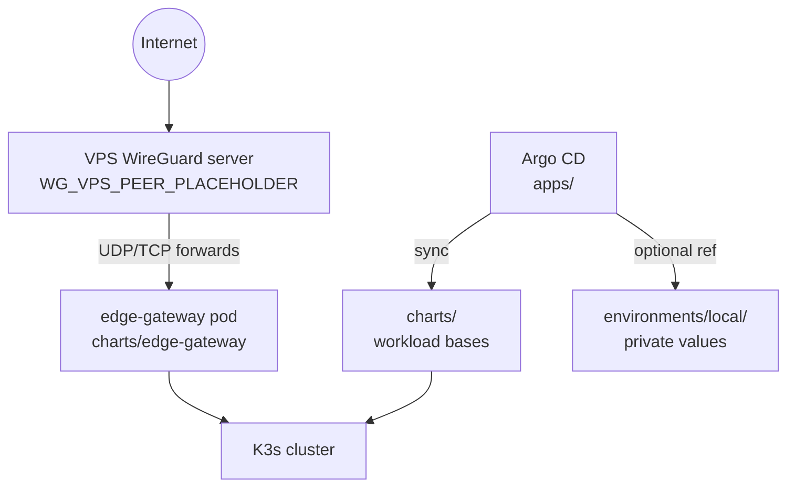

# Homelab Kubernetes Platform

| Document control | |
|------------------|--|
| **System** | Homelab GitOps platform (K3s + Argo CD) |
| **Classification** | Public architecture reference / portfolio |
| **Status** | Template — replace `PLACEHOLDER` tokens before production use |
| **Owner** | Platform engineering (homelab) |

Enterprise-style GitOps layout: **declarative manifests** in `charts/`, **orchestration** in `apps/`, **sanitized examples** in `config/examples/`, and **private overlays** in `environments/local/` (never published).

---

## 1. Executive summary

Single-cluster homelab platform delivering media, gaming, tactical awareness (TAK), and observability workloads. Traffic enters through an **edge WireGuard gateway** on a VPS; internal services run on **K3s** with **Argo CD** continuous reconciliation. The design prioritizes **declarative recovery**, **bounded blast radius**, and **automated hygiene** (prune, self-heal) over manual kubectl operations.

---

## 2. Architecture overview



### 2.1 Repository topology (GitOps)

| Path | Purpose | Published |
|------|---------|-----------|
| `apps/` | Argo CD `Application` resources | Yes |
| `charts/` | Kubernetes bases (Deployments, Services, NetworkPolicies) | Yes |
| `config/examples/` | Sanitized Helm/value templates | Yes |
| `environments/local/` | Real domains, LAN IPs, secrets | **No** (gitignored) |
| `bootstrap/` | Cluster install / app-of-apps entry | Yes (no secrets) |
| `scripts/sync-portfolio.sh` | Private → public sync + scrub | Yes |

### 2.2 Control plane

- **Desired state**: Git `HEAD` (or pinned `targetRevision`).
- **Reconciliation**: Argo CD automated sync with `prune` and `selfHeal`.
- **Drift**: Corrected on next sync; manual cluster edits are ephemeral.
- **Multi-source**: Helm charts from upstream repos; value files from this repo (`kube-prometheus-stack` pattern).

---

## 3. Reliability & fault tolerance

### 3.1 Service level objectives (homelab)

| Tier | Workload examples | Availability target | RTO | RPO |
|------|-------------------|---------------------|-----|-----|
| A | edge-gateway, TAK | Best effort with fast restore from Git | &lt; 1 h | Git-only (stateless config) |
| B | Jellyfin, game servers | Restart tolerated; brief player disconnect | &lt; 4 h | PVC snapshots / game saves |
| C | Monitoring | Observability gap acceptable during node maintenance | &lt; 24 h | Metrics rebuild acceptable |

### 3.2 Failure modes & mitigations

| Failure | Impact | Detection | Mitigation |
|---------|--------|-----------|------------|
| K3s node loss | Pod reschedule delay | Node `NotReady`, Argo `Degraded` | Second node or restore from backup manifest; Longhorn replication |
| VPS / WG down | No inbound game/TAK | External probe, WG handshake timeout | VPS rebuild from `charts/edge-gateway/*.example`; DNS failover manual |
| Argo CD outage | No new deploys; running workloads continue | Argo UI / CLI | Reinstall from `bootstrap/`; apps resync from Git |
| Bad manifest push | Rollout failure, partial sync | Argo sync error, `kubectl` events | Git revert; optional sync rollback; NetworkPolicy contains blast radius |
| PVC corruption | Data loss for stateful apps | App errors, volume mount failures | Longhorn snapshot restore; offline backups for Tier B |
| Image pull failure | CrashLoop | ImagePullBackOff | Pin digests in private overlay; local registry mirror |

### 3.3 Resilience patterns in this repo

- **NetworkPolicies** on gaming and edge namespaces restrict lateral movement.
- **Init / readiness** patterns in edge-gateway (DNS wait, `wg0` bring-up) avoid half-open forwards.
- **Separate namespaces** per domain (`gaming`, `tak`, `media`, `edge-gateway`).
- **Idempotent VPS scripts** (`vps-forward.sh.example` `up`/`down`) for clean rule teardown.
- **Git as source of truth** — cluster rebuild = reinstall K3s + Argo + sync all apps.

### 3.4 Backup & restore

| Asset | Method | Restore |
|-------|--------|---------|
| Git manifests | Remote Git | Re-apply `apps/` |
| Longhorn volumes | Scheduled snapshots | Volume restore + redeploy |
| WireGuard keys | Offline secret store | Recreate K8s secret `wg-gateway-config` |
| TAK certs | `scripts/tak-client-cert.sh` (private) | Regenerate client bundles |

---

## 4. Security architecture

- **Secrets**: Never committed; `wg0.conf`, `.env`, cert bundles excluded via `.gitignore` and rsync excludes.
- **Publication hygiene**: `scripts/sync-portfolio.sh` replaces LAN IPs, personal domains, and account names with `UPPER_SNAKE_CASE` placeholders; `--verify` fails CI if patterns leak.
- **Edge exposure**: Only required UDP/TCP ports published on VPS; homelab WG client uses narrow `AllowedIPs`.
- **RBAC**: Standard K3s defaults; tighten with explicit `ServiceAccount` per app as fleet grows.

---

## 5. Workload catalog

| Application | Namespace | Ingress pattern | Notes |
|-------------|-----------|-----------------|-------|
| edge-gateway | `edge-gateway` | VPS DNAT → WG → cluster | Vintage Story, TAK forwarding |
| vintage-story | `gaming` | NodePort / VPS | Stateful PVC |
| vintage-story-2 | `gaming` | NodePort / VPS | Second instance |
| tak-server | `tak` | NodePort + VPS 8089/8443 | PostGIS + shared volume |
| jellyfin | `media` | Ingress / NodePort | `APP_JELLYFIN_HOST_PLACEHOLDER` |
| kube-prometheus-stack | `monitoring` | Grafana ingress | Values in `config/examples/` |
| tax-payer | `cron` | Internal | Image build script uses placeholders |

---

## 6. Operations

### 6.1 Prerequisites

- K3s (or Kubernetes) with default storage class (e.g. Longhorn)
- Argo CD installed in `argocd` namespace
- `kubectl`, `argocd` CLI, `rsync`

### 6.2 Deploy

```bash
kubectl apply -f apps/argocd.yml          # namespace bootstrap if needed
kubectl apply -f apps/                  # all Applications
```

Replace `GITHUB_ORG_PLACEHOLDER` in `apps/*.yml` with your public org before publishing.

### 6.3 Publish private config to this portfolio

```bash
cp config/sync-portfolio.conf.example config/sync-portfolio.conf
# Edit SCRUB_RULES for your lab

# 1) Create private clone (once) — keep real IPs/domains only here
git clone git@github.com:YOUR_USER/homelab-k8s.git ~/Code/homelab/homelab-k8s-public

export PRIVATE_SRC=~/Code/homelab/homelab-k8s-public
export PUBLIC_DEST=~/Code/homelab/homelab-k8s   # this portfolio repo
./scripts/sync-portfolio.sh --dry-run
./scripts/sync-portfolio.sh
./scripts/sync-portfolio.sh --verify   # CI gate
```

### 6.4 Placeholder reference

| Token | Replace with |
|-------|----------------|
| `GITHUB_ORG_PLACEHOLDER` | Public GitHub org/user |
| `LAN_NODE_IP_PRIMARY` | Primary K3s/LAN node |
| `LAN_NODE_IP_SECONDARY` | Secondary node |
| `APP_JELLYFIN_HOST_PLACEHOLDER` | Jellyfin DNS name |
| `APP_GRAFANA_HOST_PLACEHOLDER` | Grafana DNS name |
| `DOMAIN_SUFFIX_PLACEHOLDER` | Internal DNS suffix |
| `LINUX_USER_PLACEHOLDER` | SSH / build user |
| `WG_*_PLACEHOLDER` | WireGuard tunnel IPs |

---

## 7. Observability

- **Metrics / alerts**: `kube-prometheus-stack` (see `apps/kube-prometheus-stack.yml`).
- **Logs**: Container stdout; optional Loki not included in base portfolio.
- **GitOps health**: Argo CD application conditions; enable notifications (Slack/email) in private overlay.

---

## License

Apache-2.0
